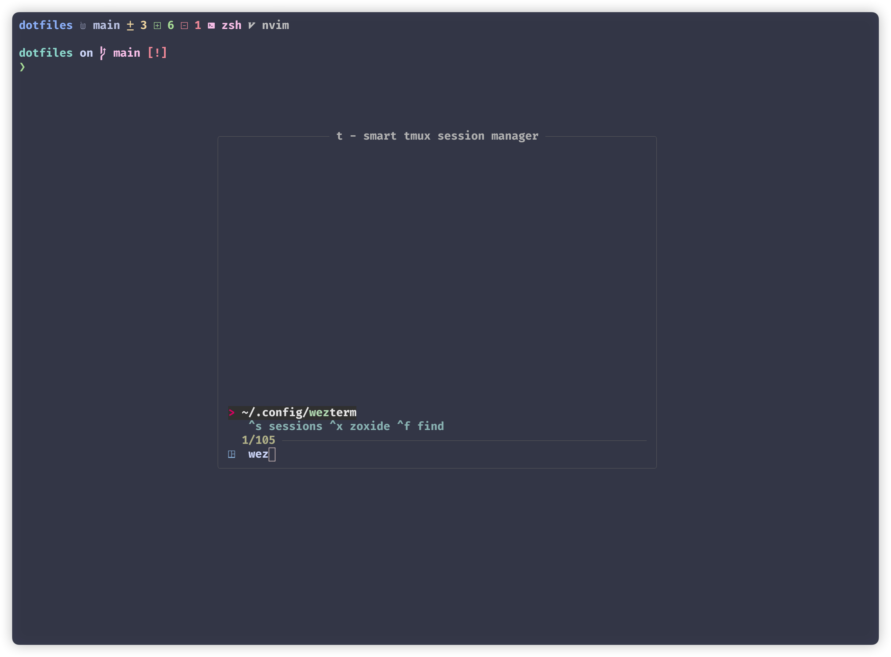
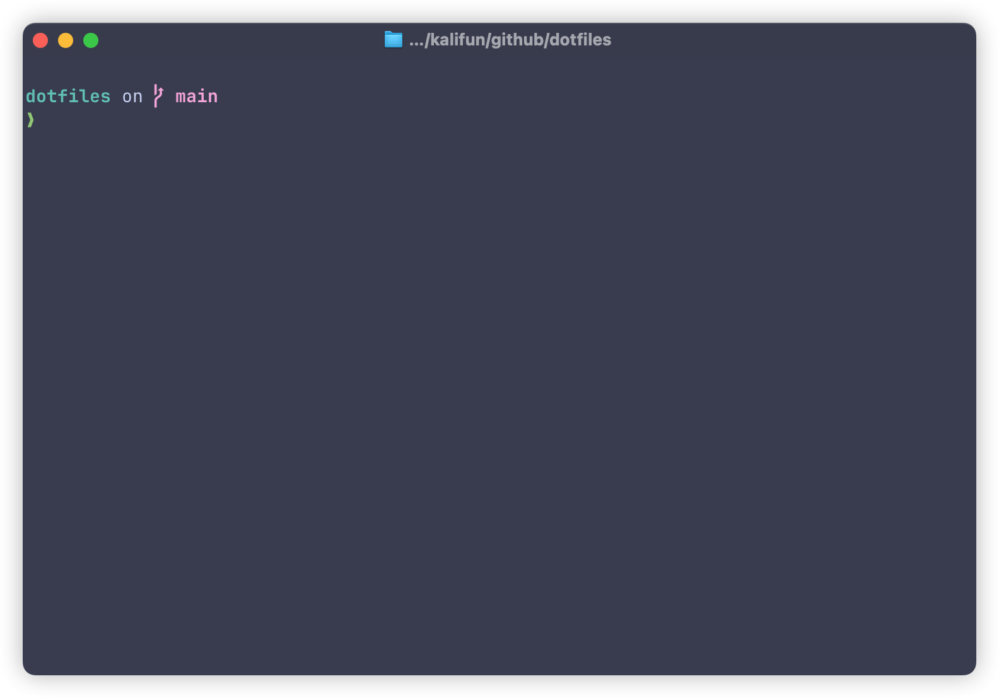

# dotfiles

Configuration item content:

- alacritty
- helix editor
- tmux
- zsh
- ghostty

## quickstart

### install

Prerequisites

- neovim (>=0.9.4)
- tmux (>= 3.2)
- tpm
- bash (>= 4.0)
- zoxide
- fzf (>=0.35.0)
- yq

```bash
brew install neovim
brew install tmux
brew install --cask wezterm
brew tap arl/arl
brew install gitmux bash zoxide fzf yq
brew install --cask ghostty
```

Tmux uses tpm to manage plug-ins, so you remember to perform plug-in installation(`prefix` + `I`).

## Screenshots

### Neovim

#### alpha


#### editor


#### telescope


### Helix


### Tmux

> `t` is a smart tmux session manager and `gitmux` is tmux status bar



### Ghostty



