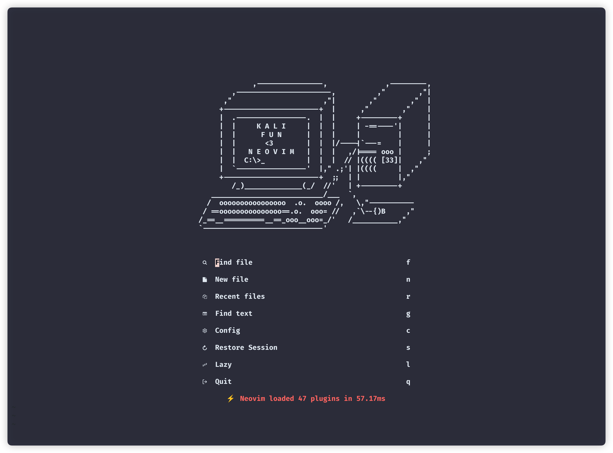
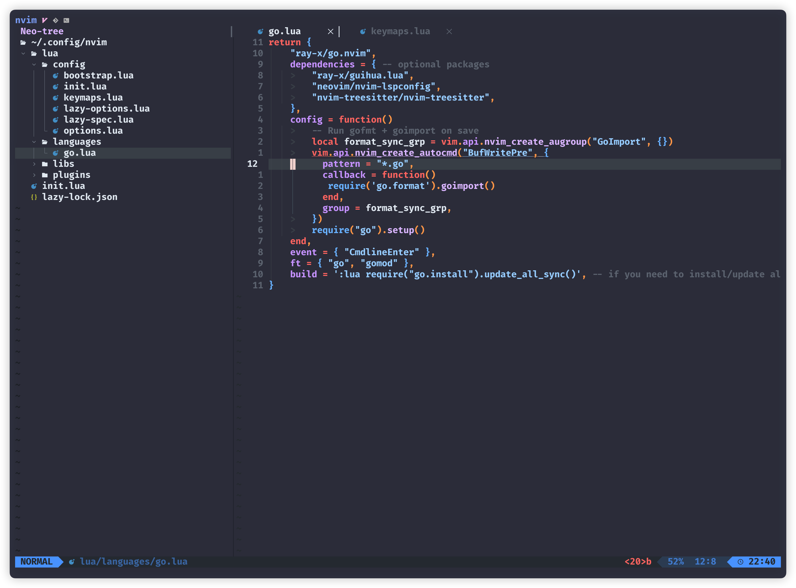
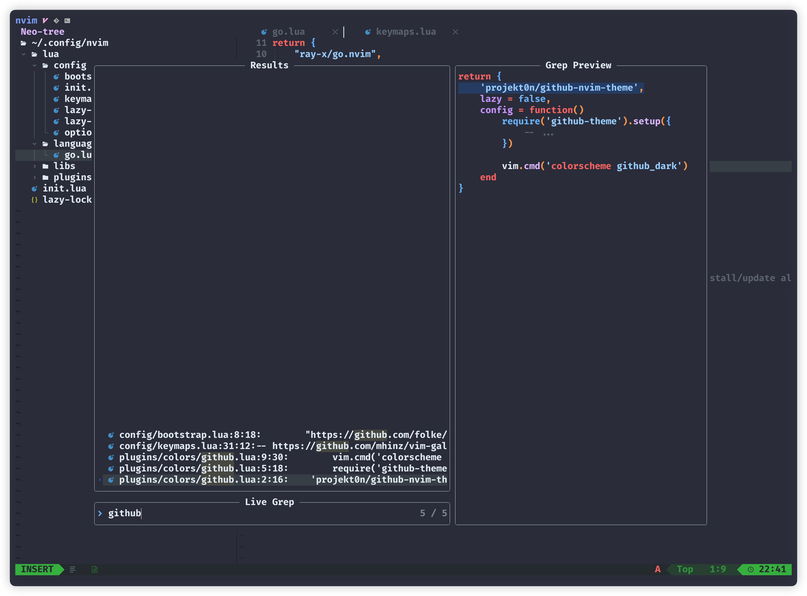
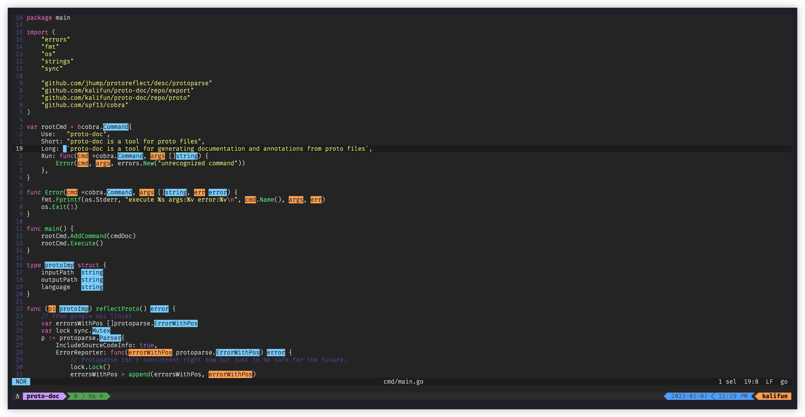

# dotfiles

Configuration item content:  
- alacritty
- helix editor
- tmux  
- zsh

## quickstart

### install

Prerequisites

- neovim (>=0.9.4)
- tmux (>= 3.2)
- tpm
- bash (>= 4.0)
- zoxide
- fzf (>=0.35.0)

```bash
brew install neovim
brew install tmux
brew install --cask wezterm
brew tap arl/arl
brew install gitmux bash zoxide fzf
```
Tmux uses tpm to manage plug-ins, so you remember to perform plug-in installation(`prefix` + `I`).


## Screenshots  

### Neovim

#### alpha



#### editor



#### telescope



### Helix  

